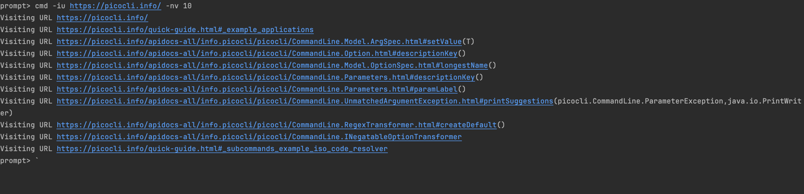

# Web Crawler

This app allows you to do web crawling, you can provide a initial url and total number of website to be searched via (numberOfVisits flag). 
The App will first visit the initial URL and it will download the page and save it to the give folder location (if provided in the command else it will saved in current directory).
Further the app will extract all the anchor tag `<a href>` from the downloaded html and will extract all the child urls (as per rules defined in assignment) and will visit the links and download the page.
This will keep on going recursively, until all the URLs are visited or the number of visits flag are reached.

### Prerequisite 
- Java 17
- Maven (build)

### How to run the app
- maven clean install
- java -jar ./target/my-web-crawler-1.0-SNAPSHOT-jar-with-dependencies.jar 
- cmd -iu https://picocli.info/ -nv 10
- Press CTRL-C to break out of the prompt

The output of the command showing all the website visited by the app:

### Following flag you can use in the command line
| short  | full                | description                                                     |
|-----------|---------------------|-----------------------------------------------------------------|
| -iu       | --initial-url       | Address of the website for crawling/scrapping                   |
| -nv       | --number-of-visits  | Number of URLs to be visited                                    |
| -fp       | --folder-path       | Location of the folder where downloaded html page will be saved |